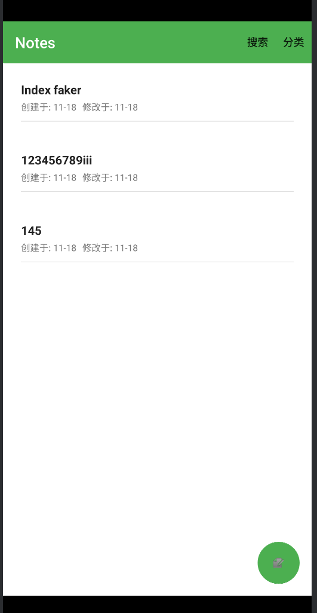
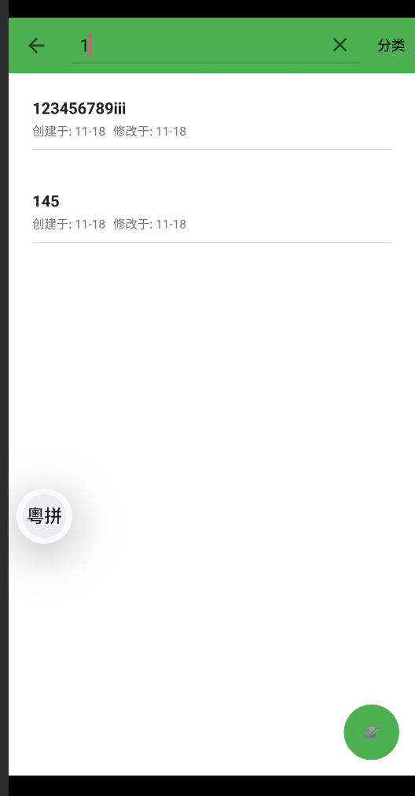
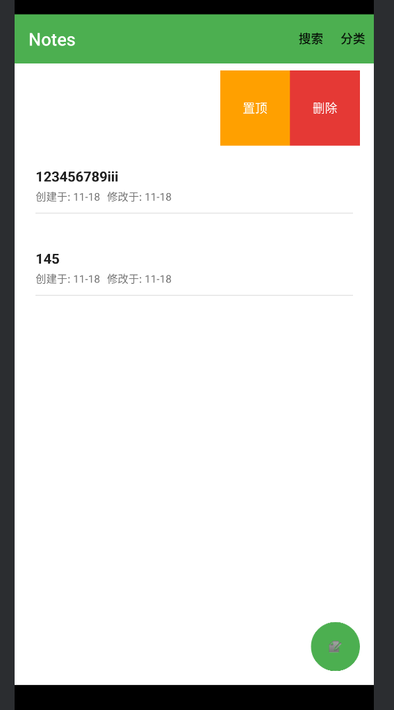
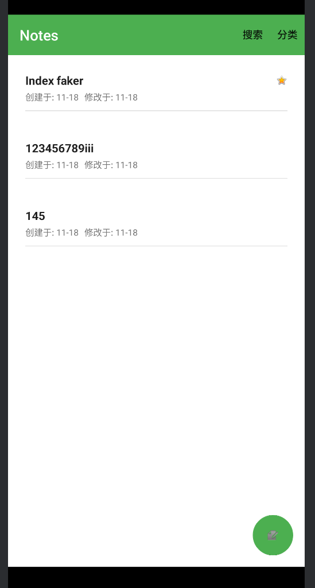
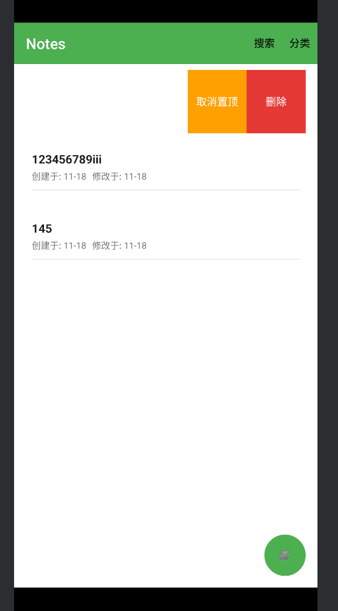
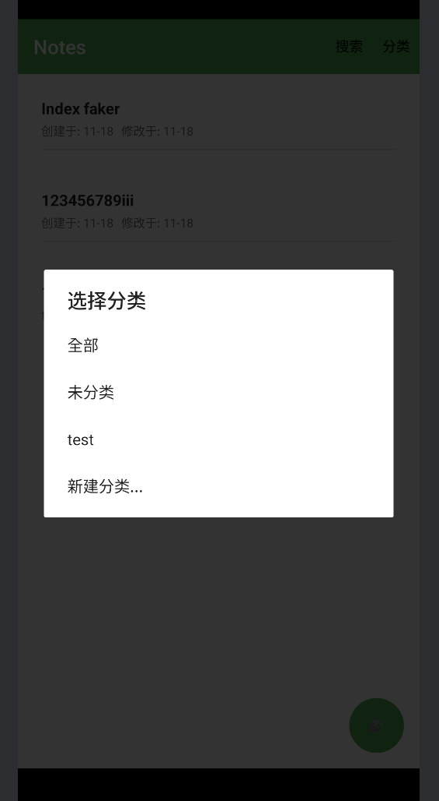
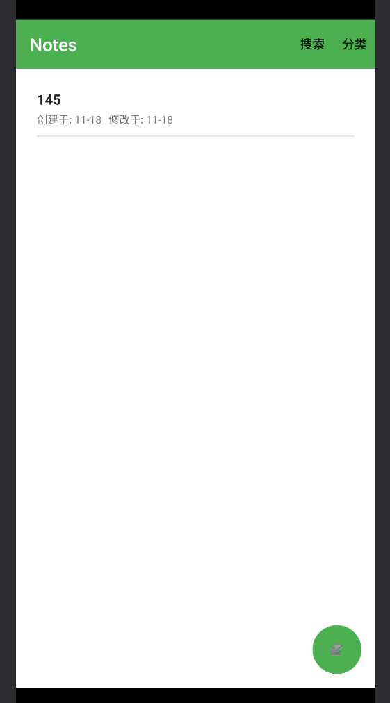
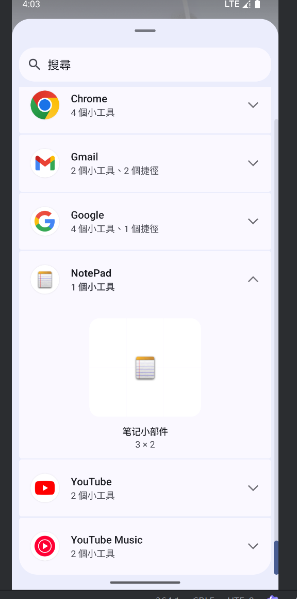
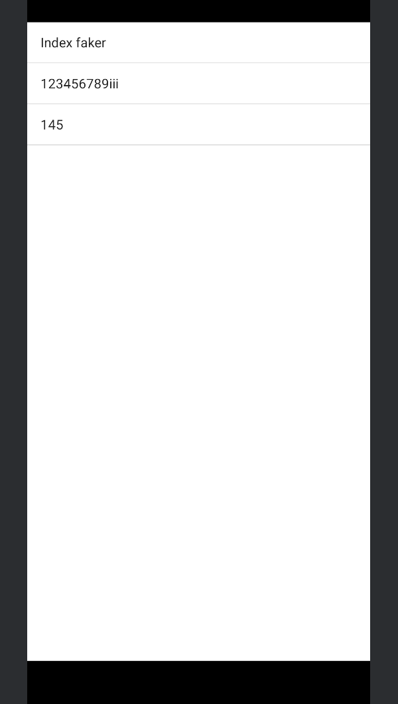
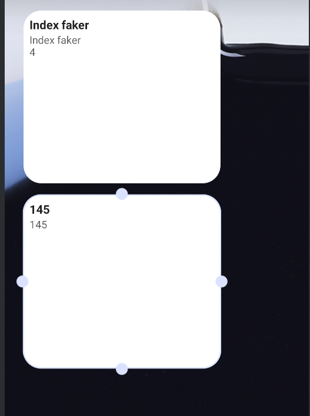

# NotePad期中实验总结

## 1. 时间戳的添加与展示

- Provider 在插入笔记时为创建时间与修改时间设置默认值。
- 列表页在每个项中展示“创建于”“修改于”，同日显示时分，跨日显示月日。

关键代码（路径相对 `app/src/main/java`）：

`NotePadProvider.java`（插入默认时间）

```java
/**
 * 插入笔记时设置创建/修改时间默认值
 */
@Override
public Uri insert(Uri uri, ContentValues initialValues) {
    ContentValues values = initialValues != null ? new ContentValues(initialValues) : new ContentValues();

    Long now = System.currentTimeMillis();

    if (!values.containsKey(NotePad.Notes.COLUMN_NAME_CREATE_DATE)) {
        values.put(NotePad.Notes.COLUMN_NAME_CREATE_DATE, now);
    }
    if (!values.containsKey(NotePad.Notes.COLUMN_NAME_MODIFICATION_DATE)) {
        values.put(NotePad.Notes.COLUMN_NAME_MODIFICATION_DATE, now);
    }
    if (!values.containsKey(NotePad.Notes.COLUMN_NAME_TITLE)) {
        Resources r = Resources.getSystem();
        values.put(NotePad.Notes.COLUMN_NAME_TITLE, r.getString(android.R.string.untitled));
    }
    if (!values.containsKey(NotePad.Notes.COLUMN_NAME_NOTE)) {
        values.put(NotePad.Notes.COLUMN_NAME_NOTE, "");
    }
    // ... 插入逻辑
}
```

`NotesList.java`（列表项绑定时间展示）

```java
/**
 * 列表项绑定：展示标题、创建时间、修改时间
 */
@Override
public void bindView(View view, Context context, Cursor cursor) {
    TextView titleView = view.findViewById(android.R.id.text1);
    titleView.setText(cursor.getString(COLUMN_INDEX_TITLE));

    TextView createdTimeView = view.findViewById(R.id.text_created_time);
    long createdTime = cursor.getLong(COLUMN_INDEX_CREATE_DATE);
    createdTimeView.setText("创建于: " + formatTime(createdTime));

    TextView modifiedTimeView = view.findViewById(R.id.text_modified_time);
    long modifiedTime = cursor.getLong(COLUMN_INDEX_MODIFICATION_DATE);
    modifiedTimeView.setText("修改于: " + formatTime(modifiedTime));
}

private String formatTime(long time) {
    if (time == 0) return "";
    // 如果是今天，显示时间；否则显示日期
    if (DateUtils.isToday(time)) {
        return DateFormat.format("HH:mm", time).toString();
    } else {
        return DateFormat.format("MM-dd", time).toString();
    }
}
```

---

## 2. 搜索功能的添加（内联搜索）

- 顶部栏将搜索作为 `SearchView` 的内联组件，折叠态显示图标、展开后直接输入。
- 搜索按标题与内容模糊匹配，实时刷新列表；关闭或折叠时清空搜索。

关键代码：

`res/menu/toolbar_menu.xml`（菜单项定义）

```xml
<!-- 顶部栏内联搜索：折叠态显示图标，展开态显示输入框 -->
<item
    android:id="@+id/menu_toolbar_search"
    android:title="搜索"
    app:icon="@android:drawable/ic_menu_search"
    app:showAsAction="always|collapseActionView"
    app:actionViewClass="android.support.v7.widget.SearchView" />
```

`NotesList.java`（绑定与查询）

```java
/**
 * 顶部栏内联搜索绑定与监听
 */
final MenuItem searchItem = toolbar.getMenu().findItem(R.id.menu_toolbar_search);
final SearchView searchView = (SearchView) MenuItemCompat.getActionView(searchItem);
if (searchView != null) {
    searchView.setQueryHint("搜索标题或内容");
    searchView.setOnQueryTextListener(new SearchView.OnQueryTextListener() {
        public boolean onQueryTextSubmit(String q) { mSearchQuery = q.trim(); refreshNotesList(); return true; }
        public boolean onQueryTextChange(String t) { mSearchQuery = t.trim(); refreshNotesList(); return true; }
    });
    searchView.setOnCloseListener(() -> { mSearchQuery = ""; refreshNotesList(); return false; });
}

/**
 * 根据搜索与分类组合 WHERE 条件刷新列表
 */
private void refreshNotesList() {
    ArrayList<String> parts = new ArrayList<>();
    ArrayList<String> args = new ArrayList<>();

    if (mSearchQuery != null && !mSearchQuery.isEmpty()) {
        parts.add(NotePad.Notes.COLUMN_NAME_TITLE + " LIKE ? OR " + NotePad.Notes.COLUMN_NAME_NOTE + " LIKE ?");
        String p = "%" + mSearchQuery + "%"; args.add(p); args.add(p);
    }
    if (mCategoryId >= 0) { // -1 表示“全部”
        parts.add(NotePad.Notes.COLUMN_NAME_CATEGORY_ID + " = ?");
        args.add(String.valueOf(mCategoryId));
    }

    String selection = parts.isEmpty() ? null : android.text.TextUtils.join(" AND ", parts);
    String[] selectionArgs = args.isEmpty() ? null : args.toArray(new String[0]);

    Cursor cursor = managedQuery(getIntent().getData(), PROJECTION, selection, selectionArgs, NotePad.Notes.DEFAULT_SORT_ORDER);
    mAdapter.changeCursor(cursor);
}
```

---

## 3. UI 的美化（顶部栏与列表交互）

- 顶部栏仅保留搜索图标、增加分类图标；
- 列表项支持 QQ 式左滑显示“置顶/删除”，同时支持右滑收起；轻触打开编辑页面。
- 置顶以星标显示，标题右侧显式可见；置顶不再修改时间，使用 `pinned` 字段。
- 滑动展开
- 
- 选择置顶
- 

关键代码：

`res/layout/noteslist_item.xml`（前景卡片 + 背后操作区 + 星标）

```xml
<!-- 背后操作区 -->
<LinearLayout
    android:id="@+id/actions_container"
    android:layout_width="match_parent"
    android:layout_height="match_parent"
    android:gravity="end|center_vertical"
    android:orientation="horizontal"
    android:paddingEnd="8dp"
    android:clipToPadding="false" />

<!-- 前景卡片 -->
<android.support.v7.widget.CardView
    android:id="@+id/content_container"
    android:layout_width="match_parent"
    android:layout_height="wrap_content"
    app:cardUseCompatPadding="false"
    app:cardElevation="4dp"
    app:cardBackgroundColor="@color/cardBackground">
    <!-- 标题行：左标题，右侧置顶星标 -->
    <LinearLayout ...>
        <TextView android:id="@android:id/text1" android:layout_weight="1" ... />
        <ImageView android:id="@+id/image_pinned" android:src="@android:drawable/btn_star_big_on" android:visibility="gone" />
    </LinearLayout>
</android.support.v7.widget.CardView>
```

`NotesList.java`（左滑展开、右滑收起、轻触打开、置顶切换与星标）

```java
/**
 * 列表项手势：左滑显示操作、右滑收起、轻触打开编辑页
 */
content.setOnTouchListener(new View.OnTouchListener() {
    float downX, downY, startTx; boolean swiping; int actionsWidth;
    final int fixedWidth = (int)(160 * view.getResources().getDisplayMetrics().density);
    public boolean onTouch(View v, MotionEvent e) {
        switch (e.getActionMasked()) {
            case MotionEvent.ACTION_DOWN:
                downX = e.getX(); downY = e.getY(); startTx = content.getTranslationX();
                v.getParent().requestDisallowInterceptTouchEvent(true);
                actionsWidth = actions.getWidth(); if (actionsWidth <= 0) actionsWidth = fixedWidth;
                return true;
            case MotionEvent.ACTION_MOVE:
                float dx = e.getX() - downX;
                if (dx < -10 || (startTx < 0 && dx > 10)) swiping = true;
                if (swiping) {
                    float tx = Math.max(-actionsWidth, Math.min(0, startTx + dx));
                    content.setTranslationX(tx);
                    actions.setVisibility(tx < 0 ? View.VISIBLE : View.INVISIBLE);
                    return true;
                }
                break;
            case MotionEvent.ACTION_UP:
            case MotionEvent.ACTION_CANCEL:
                if (swiping) {
                    float tx = content.getTranslationX();
                    float target = (Math.abs(tx) > (actionsWidth * 0.33f)) ? -actionsWidth : 0f;
                    content.animate().translationX(target).setDuration(180)
                           .setListener(new AnimatorListenerAdapter() {
                               public void onAnimationEnd(Animator a) {
                                   actions.setVisibility(content.getTranslationX() == 0f ? View.INVISIBLE : View.VISIBLE);
                               }
                           });
                    swiping = false; return true;
                } else {
                    if (Math.abs(e.getX() - downX) < 8 && Math.abs(e.getY() - downY) < 8 && content.getTranslationX() == 0f) {
                        startActivity(new Intent(Intent.ACTION_EDIT, ContentUris.withAppendedId(getIntent().getData(), noteId)));
                        return true;
                    }
                }
                break;
        }
        return false;
    }
});

/**
 * 切换置顶状态（0/1），并展示星标
 */
int pinned = cursor.getInt(cursor.getColumnIndex(NotePad.Notes.COLUMN_NAME_PINNED));
view.findViewById(R.id.image_pinned).setVisibility(pinned == 1 ? View.VISIBLE : View.GONE);
View pin = view.findViewById(R.id.action_pin);
if (pin instanceof TextView) ((TextView) pin).setText(pinned == 1 ? "取消置顶" : "置顶");
pin.setOnClickListener(v -> { togglePinned(noteId, pinned == 1 ? 0 : 1); content.animate().translationX(0).setDuration(160); });
```

`NotePad.java`（默认排序与置顶字段）

```java
/**
 * 默认排序：先置顶，再按修改时间降序
 */
public static final String DEFAULT_SORT_ORDER = "pinned DESC, modified DESC";

/**
 * 置顶标记字段
 */
public static final String COLUMN_NAME_PINNED = "pinned";
```

---

## 4. 笔记的分类（创建/切换/移动/编辑页设置）

- 数据结构：笔记表新增 `category_id` 字段；新增分类表 `categories(_id, name)`。
- Provider 支持分类的 CRUD 与 URI；升级与容错确保旧库平滑过渡。
- 列表顶部栏“分类”图标可选择“全部/未分类/已有分类/新建分类”，与搜索联合筛选。
- 列表项长按支持“移动到分类”；编辑页也可设置分类。
-
- 
- 点击切换分类
- 
关键代码：

`NotePad.java`（合约与字段）

```java
/**
 * 笔记所属分类ID
 */
public static final String COLUMN_NAME_CATEGORY_ID = "category_id";

/**
 * 分类表合约
 */
public static final class Categories implements BaseColumns {
    public static final Uri CONTENT_URI = Uri.parse("content://" + AUTHORITY + "/categories");
    public static final String CONTENT_TYPE = "vnd.android.cursor.dir/vnd.google.category";
    public static final String CONTENT_ITEM_TYPE = "vnd.android.cursor.item/vnd.google.category";
    public static final String TABLE_NAME = "categories";
    public static final String COLUMN_NAME_NAME = "name";
}
```

`NotePadProvider.java`（建表、排序与容错）

```java
/**
 * 数据库初始化：notes + categories
 */
db.execSQL("CREATE TABLE notes (\n" +
    "_id INTEGER PRIMARY KEY,\n" +
    "title TEXT, note TEXT,\n" +
    "created INTEGER, modified INTEGER,\n" +
    "pinned INTEGER DEFAULT 0,\n" +
    "category_id INTEGER DEFAULT 0\n" +
")");
db.execSQL("CREATE TABLE categories (\n" +
    "_id INTEGER PRIMARY KEY,\n" +
    "name TEXT\n" +
")");

/**
 * 分类与笔记的默认排序；并容错补齐缺列/缺表
 */
SQLiteDatabase db = mOpenHelper.getReadableDatabase();
try { db.execSQL("ALTER TABLE notes ADD COLUMN pinned INTEGER DEFAULT 0"); } catch (SQLException ignored) {}
try { db.execSQL("ALTER TABLE notes ADD COLUMN category_id INTEGER DEFAULT 0"); } catch (SQLException ignored) {}
try { db.execSQL("CREATE TABLE IF NOT EXISTS categories (_id INTEGER PRIMARY KEY, name TEXT)"); } catch (SQLException ignored) {}

String orderBy = TextUtils.isEmpty(sortOrder)
    ? ((match == CATEGORIES || match == CATEGORY_ID) ? (NotePad.Categories.COLUMN_NAME_NAME + " COLLATE NOCASE ASC")
                                                    : NotePad.Notes.DEFAULT_SORT_ORDER)
    : sortOrder;
```

`NotesList.java`（顶部分类切换与长按移动）

```java
/**
 * 分类图标点击：选择“全部/未分类/已有分类/新建分类”
 */
private int mCategoryId = -1; // -1=全部, 0=未分类
private void showCategoryDialog() {
    Cursor c = managedQuery(NotePad.Categories.CONTENT_URI, new String[]{ NotePad.Categories._ID, NotePad.Categories.COLUMN_NAME_NAME }, null, null, null);
    ArrayList<String> names = new ArrayList<>(); ArrayList<Integer> ids = new ArrayList<>();
    names.add("全部"); ids.add(-1); names.add("未分类"); ids.add(0);
    if (c != null) for (c.moveToFirst(); !c.isAfterLast(); c.moveToNext()) { names.add(c.getString(c.getColumnIndex(NotePad.Categories.COLUMN_NAME_NAME))); ids.add(c.getInt(c.getColumnIndex(NotePad.Categories._ID))); }
    names.add("新建分类..."); ids.add(-2);
    new AlertDialog.Builder(this).setTitle("选择分类")
        .setItems(names.toArray(new String[0]), (d, w) -> { int selId = ids.get(w); if (selId == -2) showCreateCategoryDialog(); else { mCategoryId = selId; refreshNotesList(); } })
        .show();
}

/**
 * 代码的功能
 * 更新笔记的分类ID并刷新列表
 */
private void updateNoteCategory(long noteId, int categoryId) {
    Uri noteUri = ContentUris.withAppendedId(getIntent().getData(), noteId);
    ContentValues v = new ContentValues(); v.put(NotePad.Notes.COLUMN_NAME_CATEGORY_ID, categoryId);
    getContentResolver().update(noteUri, v, null, null); refreshNotesList();
}
```

`NoteEditor.java`（编辑页设置分类）

```java
/**
 * 为当前笔记更新分类ID并通知小部件刷新
 */
private void updateCurrentNoteCategory(int categoryId) {
    if (mUri == null) return;
    ContentValues v = new ContentValues(); v.put(NotePad.Notes.COLUMN_NAME_CATEGORY_ID, categoryId);
    getContentResolver().update(mUri, v, null, null);
    sendBroadcast(new Intent(NoteWidgetProvider.ACTION_REFRESH));
}
```

---

## 5. 笔记便签的添加（桌面 App Widget）

- 可将某条笔记固定为桌面组件，显示标题与内容摘要；点击组件打开该笔记编辑页。
- 配置页选择笔记；编辑页更新后支持刷新组件。
- 桌面小组件
- 
- 
- 

关键代码：

`res/layout/note_widget.xml`（组件布局）

```xml
<!--
/**
 * 桌面笔记小部件的布局：显示标题与内容摘要
 */
-->
<LinearLayout ...>
  <TextView android:id="@+id/widget_title" ... />
  <TextView android:id="@+id/widget_content" ... />
</LinearLayout>
```

`res/xml/note_widget_info.xml`（组件元数据）

```xml
<appwidget-provider
    android:minWidth="200dp"
    android:minHeight="110dp"
    android:updatePeriodMillis="0"
    android:initialLayout="@layout/note_widget"
    android:configure="com.example.android.notepad.NoteWidgetConfigureActivity"
    android:resizeMode="horizontal|vertical"
    android:widgetCategory="home_screen" />
```

`NoteWidgetProvider.java`（Provider）

```java
/**
 * 代码的功能
 * 笔记桌面小部件 Provider：根据保存的笔记ID更新标题与内容，并支持点击打开编辑页
 */
public static void updateWidget(Context context, AppWidgetManager mgr, int appWidgetId) {
    RemoteViews views = new RemoteViews(context.getPackageName(), R.layout.note_widget);
    long noteId = context.getSharedPreferences(PREFS_NAME, Context.MODE_PRIVATE)
            .getLong(KEY_PREFIX_NOTE_ID + appWidgetId, -1);
    String title = "选择一个笔记", content = "用于显示笔记内容摘要";
    if (noteId > -1) {
        Uri noteUri = Uri.withAppendedPath(NotePad.Notes.CONTENT_URI, String.valueOf(noteId));
        Cursor c = context.getContentResolver().query(noteUri,
            new String[]{ NotePad.Notes.COLUMN_NAME_TITLE, NotePad.Notes.COLUMN_NAME_NOTE }, null, null, null);
        if (c != null) { if (c.moveToFirst()) { title = c.getString(c.getColumnIndex(NotePad.Notes.COLUMN_NAME_TITLE)); content = c.getString(c.getColumnIndex(NotePad.Notes.COLUMN_NAME_NOTE)); } c.close(); }
        PendingIntent pi = PendingIntent.getActivity(context, appWidgetId, new Intent(Intent.ACTION_EDIT, noteUri), PendingIntent.FLAG_UPDATE_CURRENT);
        views.setOnClickPendingIntent(R.id.widget_title, pi);
        views.setOnClickPendingIntent(R.id.widget_content, pi);
    }
    views.setTextViewText(R.id.widget_title, title == null ? "" : title);
    views.setTextViewText(R.id.widget_content, content == null ? "" : content);
    mgr.updateAppWidget(appWidgetId, views);
}
```

`AndroidManifest.xml`（注册）

```xml
<!-- 桌面笔记小部件配置页 -->
<activity android:name="com.example.android.notepad.NoteWidgetConfigureActivity">
    <intent-filter>
        <action android:name="android.appwidget.action.APPWIDGET_CONFIGURE" />
    </intent-filter>
</activity>

<!-- 桌面笔记小部件 Provider -->
<receiver android:name="com.example.android.notepad.NoteWidgetProvider" android:label="笔记小部件">
    <intent-filter>
        <action android:name="android.appwidget.action.APPWIDGET_UPDATE" />
        <action android:name="com.example.android.notepad.ACTION_UPDATE_NOTE_WIDGET" />
    </intent-filter>
    <meta-data android:name="android.appwidget.provider" android:resource="@xml/note_widget_info" />
</receiver>
```

---

## 小结与可拓展方向

- 旧库升级与容错：Provider 在 `query()` 里补齐缺列/缺表，避免因“no such column”导致闪退。
- 排序策略：默认 `pinned DESC, modified DESC`；分类列表按名称升序。
- 交互参数可调：左/右滑阈值与动画阈值（1/3 宽度）可按需要微调；轻触阈值为 8px。

李翔宇BackMore2 2025.11.25
