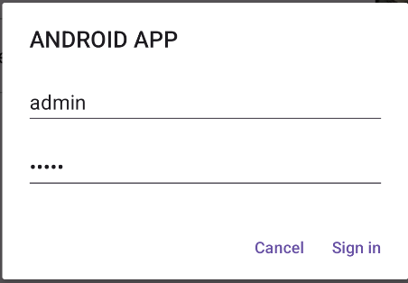
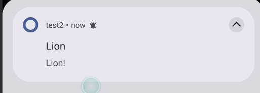
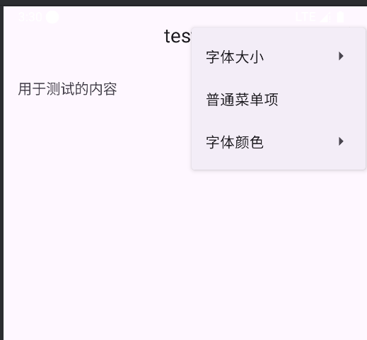
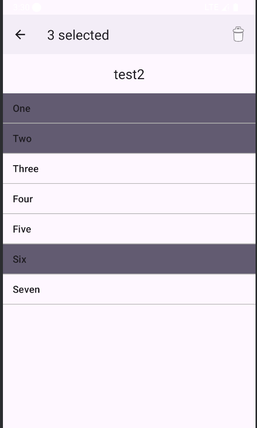

# Android 实验3

## 一、实验目的
- 掌握通过 XML 定义应用菜单（溢出菜单）的基础方法与事件处理。
- 掌握 ActionMode 上下文菜单在 `ListView` 多选场景中的使用。
- 熟悉 ConstraintLayout 与 LinearLayout 的组合使用，完成主界面底部按钮与上方列表的协调布局。
- 理解 Android 资源 ID 在 AGP 8+ 的编译特性变化，掌握规避编译错误的方法。

## 二、项目说明

- XML 菜单演示页：使用 `MaterialToolbar` 加载 `menu/xml_menu_demo.xml`，通过 Java 代码响应菜单项点击。
- ActionMode 演示页：为 `ListView` 启用 `CHOICE_MODE_MULTIPLE_MODAL`，在选择模式下显示删除等操作。

主界面底部新增两个导航按钮，分别跳转到上述演示页面，上方区域为一个填充剩余空间的 `ListView`。

---

## 三、核心布局代码

### 1. 主界面布局 `res/layout/activity_main.xml`
```xml
<?xml version="1.0" encoding="utf-8"?>
<androidx.constraintlayout.widget.ConstraintLayout xmlns:android="http://schemas.android.com/apk/res/android"
    xmlns:app="http://schemas.android.com/apk/res-auto"
    xmlns:tools="http://schemas.android.com/tools"
    android:id="@+id/main"
    android:layout_width="match_parent"
    android:layout_height="match_parent"
    tools:context=".MainActivity">

    <!-- 底部按钮区：跳转到两个演示页面 -->
    <LinearLayout
        android:id="@+id/bottomButtons"
        android:layout_width="0dp"
        android:layout_height="wrap_content"
        android:orientation="horizontal"
        android:padding="12dp"
        app:layout_constraintBottom_toBottomOf="parent"
        app:layout_constraintStart_toStartOf="parent"
        app:layout_constraintEnd_toEndOf="parent">

        <com.google.android.material.button.MaterialButton
            android:id="@+id/btnXmlMenuDemo"
            android:layout_width="0dp"
            android:layout_height="wrap_content"
            android:layout_weight="1"
            android:text="XML菜单演示"/>

        <com.google.android.material.button.MaterialButton
            android:id="@+id/btnActionModeDemo"
            android:layout_width="0dp"
            android:layout_height="wrap_content"
            android:layout_weight="1"
            android:layout_marginStart="12dp"
            android:text="ActionMode演示"/>
    </LinearLayout>

    <ListView
        android:id="@+id/listView"
        android:layout_width="0dp"
        android:layout_height="0dp"
        app:layout_constraintTop_toTopOf="parent"
        app:layout_constraintBottom_toTopOf="@id/bottomButtons"
        app:layout_constraintStart_toStartOf="parent"
        app:layout_constraintEnd_toEndOf="parent"
        android:divider="@android:color/darker_gray"
        android:dividerHeight="1dp"/>

</androidx.constraintlayout.widget.ConstraintLayout>
```


### 2. 列表项布局 `res/layout/list_item.xml`
```xml
<?xml version="1.0" encoding="utf-8"?>
<LinearLayout xmlns:android="http://schemas.android.com/apk/res/android"
    android:layout_width="match_parent"
    android:layout_height="64dp"
    android:padding="8dp"
    android:gravity="center_vertical"
    android:orientation="horizontal">

    <!-- 文字在左，占满剩余空间 -->
    <TextView
        android:id="@+id/title"
        android:layout_width="0dp"
        android:layout_height="wrap_content"
        android:layout_weight="1"
        android:layout_marginEnd="12dp"
        android:textColor="#000000"
        android:textSize="18sp"
        android:singleLine="true"
        android:ellipsize="end"/>

    <!-- 图片在右，固定大小 -->
    <ImageView
        android:id="@+id/icon"
        android:layout_width="48dp"
        android:layout_height="48dp"
        android:scaleType="centerCrop"
        android:contentDescription="@null"/>

</LinearLayout>
```

### 3. XML 菜单页布局 `res/layout/activity_xml_menu_demo.xml`
```xml
<?xml version="1.0" encoding="utf-8"?>
<LinearLayout xmlns:android="http://schemas.android.com/apk/res/android"
    xmlns:app="http://schemas.android.com/apk/res-auto"
    android:layout_width="match_parent"
    android:layout_height="match_parent"
    android:orientation="vertical">

    <com.google.android.material.appbar.MaterialToolbar
        android:id="@+id/toolbar"
        android:layout_width="match_parent"
        android:layout_height="wrap_content"
        android:title="使用XML定义菜单"
        app:titleCentered="true"/>

    <TextView
        android:id="@+id/tvContent"
        android:layout_width="match_parent"
        android:layout_height="wrap_content"
        android:text="用于测试的内容"
        android:textSize="16sp"
        android:padding="16dp" />

</LinearLayout>
```

### 4. ActionMode 页布局 `res/layout/activity_action_mode_demo.xml`
```xml
<?xml version="1.0" encoding="utf-8"?>
<LinearLayout xmlns:android="http://schemas.android.com/apk/res/android"
    xmlns:app="http://schemas.android.com/apk/res-auto"
    android:layout_width="match_parent"
    android:layout_height="match_parent"
    android:orientation="vertical">

    <com.google.android.material.appbar.MaterialToolbar
        android:id="@+id/toolbar"
        android:layout_width="match_parent"
        android:layout_height="wrap_content"
        android:title="ActionMode上下文菜单"
        app:titleCentered="true"/>

    <ListView
        android:id="@+id/listViewAction"
        android:layout_width="match_parent"
        android:layout_height="match_parent"
        android:choiceMode="multipleChoiceModal"
        android:divider="@android:color/darker_gray"
        android:dividerHeight="1dp"/>

</LinearLayout>
```

---

## 四、核心菜单与交互代码

### 1. XML 菜单定义 `res/menu/xml_menu_demo.xml`
```xml
<?xml version="1.0" encoding="utf-8"?>
<menu xmlns:android="http://schemas.android.com/apk/res/android"
    xmlns:app="http://schemas.android.com/apk/res-auto">

    <item
        android:id="@+id/menu_font_size"
        android:title="字体大小">
        <menu>
            <item
                android:id="@+id/menu_small"
                android:title="小(10sp)" />
            <item
                android:id="@+id/menu_medium"
                android:title="中(16sp)" />
            <item
                android:id="@+id/menu_large"
                android:title="大(20sp)" />
        </menu>
    </item>

    <item
        android:id="@+id/menu_plain"
        android:title="普通菜单项"
        app:showAsAction="never" />

    <item
        android:id="@+id/menu_font_color"
        android:title="字体颜色">
        <menu>
            <item
                android:id="@+id/menu_red"
                android:title="红色" />
            <item
                android:id="@+id/menu_black"
                android:title="黑色" />
        </menu>
    </item>
</menu>
```

### 2. ActionMode 菜单定义 `res/menu/action_mode_menu.xml`
```xml
<?xml version="1.0" encoding="utf-8"?>
<menu xmlns:android="http://schemas.android.com/apk/res/android"
    xmlns:app="http://schemas.android.com/apk/res-auto">
    <item
        android:id="@+id/action_delete"
        android:title="删除"
        android:icon="@android:drawable/ic_menu_delete"
        app:showAsAction="ifRoom"/>
</menu>
```

### 3. XML 菜单页交互 `java/com/backmo/test2/XmlMenuDemoActivity.java`
```java
public class XmlMenuDemoActivity extends AppCompatActivity {
    private TextView tvContent;

    @Override
    protected void onCreate(Bundle savedInstanceState) {
        super.onCreate(savedInstanceState);
        setContentView(R.layout.activity_xml_menu_demo);
        MaterialToolbar toolbar = findViewById(R.id.toolbar);
        setSupportActionBar(toolbar);
        tvContent = findViewById(R.id.tvContent);
    }

    @Override
    public boolean onCreateOptionsMenu(Menu menu) {
        getMenuInflater().inflate(R.menu.xml_menu_demo, menu);
        return true;
    }

    // 兼容 AGP 8：使用 if/else 而非 switch(R.id)
    @Override
    public boolean onOptionsItemSelected(MenuItem item) {
        int id = item.getItemId();
        if (id == R.id.menu_small) {
            tvContent.setTextSize(10);
            return true;
        } else if (id == R.id.menu_medium) {
            tvContent.setTextSize(16);
            return true;
        } else if (id == R.id.menu_large) {
            tvContent.setTextSize(20);
            return true;
        } else if (id == R.id.menu_plain) {
            Toast.makeText(this, "普通菜单项被点击", Toast.LENGTH_SHORT).show();
            return true;
        } else if (id == R.id.menu_red) {
            tvContent.setTextColor(Color.RED);
            return true;
        } else if (id == R.id.menu_black) {
            tvContent.setTextColor(Color.BLACK);
            return true;
        }
        return super.onOptionsItemSelected(item);
    }
}
```

### 4. ActionMode 页交互 `java/com/backmo/test2/ActionModeDemoActivity.java`
```java
public class ActionModeDemoActivity extends AppCompatActivity {
    private ListView listView;
    private ArrayAdapter<String> adapter;
    private final List<String> data = new ArrayList<>(
            Arrays.asList("One", "Two", "Three", "Four", "Five", "Six", "Seven"));

    @Override
    protected void onCreate(Bundle savedInstanceState) {
        super.onCreate(savedInstanceState);
        setContentView(R.layout.activity_action_mode_demo);
        MaterialToolbar toolbar = findViewById(R.id.toolbar);
        setSupportActionBar(toolbar);

        listView = findViewById(R.id.listViewAction);
        adapter = new ArrayAdapter<>(this, android.R.layout.simple_list_item_activated_1, data);
        listView.setAdapter(adapter);

        listView.setChoiceMode(ListView.CHOICE_MODE_MULTIPLE_MODAL);
        listView.setMultiChoiceModeListener(new android.widget.AbsListView.MultiChoiceModeListener() {
            @Override
            public void onItemCheckedStateChanged(android.view.ActionMode mode, int position, long id, boolean checked) {
                int count = listView.getCheckedItemCount();
                mode.setTitle(count + " selected");
            }

            @Override
            public boolean onCreateActionMode(android.view.ActionMode mode, Menu menu) {
                getMenuInflater().inflate(R.menu.action_mode_menu, menu);
                return true;
            }

            @Override public boolean onPrepareActionMode(android.view.ActionMode mode, Menu menu) { return false; }

            @Override
            public boolean onActionItemClicked(android.view.ActionMode mode, MenuItem item) {
                if (item.getItemId() == R.id.action_delete) {
                    deleteCheckedItems();
                    mode.finish();
                    return true;
                }
                return false;
            }

            @Override
            public void onDestroyActionMode(android.view.ActionMode mode) {
                for (int i = 0; i < listView.getCount(); i++) {
                    listView.setItemChecked(i, false);
                }
            }
        });
    }

    private void deleteCheckedItems() {
        SparseBooleanArray checked = listView.getCheckedItemPositions();
        List<String> toRemove = new ArrayList<>();
        for (int i = 0; i < checked.size(); i++) {
            int position = checked.keyAt(i);
            if (checked.valueAt(i)) {
                toRemove.add(adapter.getItem(position));
            }
        }
        data.removeAll(toRemove);
        adapter.notifyDataSetChanged();
        Toast.makeText(this, "已删除 " + toRemove.size() + " 项", Toast.LENGTH_SHORT).show();
    }
}
```

### 5. 主界面按钮跳转 `java/com/backmo/test2/MainActivity.java`（片段）
```java
findViewById(R.id.btnXmlMenuDemo).setOnClickListener(v ->
        startActivity(new Intent(this, XmlMenuDemoActivity.class)));
findViewById(R.id.btnActionModeDemo).setOnClickListener(v ->
        startActivity(new Intent(this, ActionModeDemoActivity.class)));
```

---

## 五、组件注册与清单文件
在 `AndroidManifest.xml` 中注册两个新页面，并保持 `MainActivity` 为启动页：
```xml
<activity android:name=".XmlMenuDemoActivity" />
<activity android:name=".ActionModeDemoActivity" />
```

---

## 六、运行与演示
- 构建命令（Windows）：`./gradlew.bat assembleDebug`
- 运行后，主界面底部显示两个按钮：
  - `XML菜单演示`：进入后点击工具栏溢出菜单，验证字体大小与颜色调整、普通项点击提示。
  - `ActionMode演示`：长按列表项进入选择模式，勾选多个项并点击删除按钮验证批量删除。


-点击任意一个列表项

- 弹出通知



---

## 七、问题与解决

- `switch(R.id.xxx)` 编译错误：AGP 8+ 中 `R.id` 不再是 `final` 常量，会导致 `switch` 需要常量表达式的冲突。本项目已在 `XmlMenuDemoActivity.onOptionsItemSelected` 中改用 `if/else` 结构以兼容。
  - 备选但不推荐的方案：`gradle.properties` 中设置 `android.nonFinalResIds=false`。

---

## 八、总结
- 通过本实验，完成了主界面的底部按钮导航布局与上方列表区域的协作显示；
- 掌握了 XML 菜单与上下文 ActionMode 菜单的定义与交互处理；
